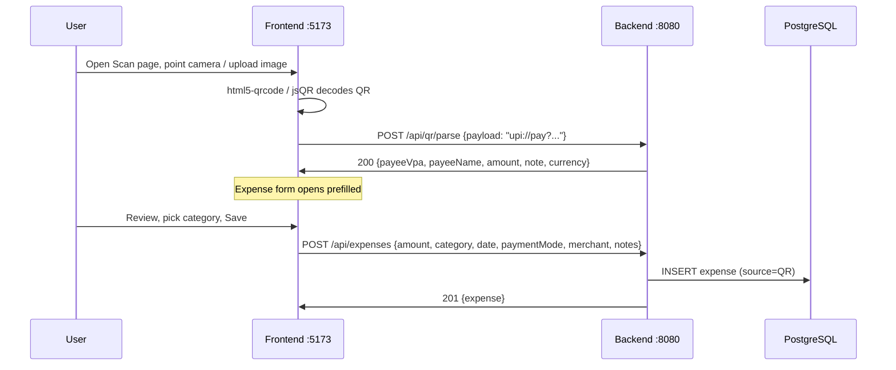
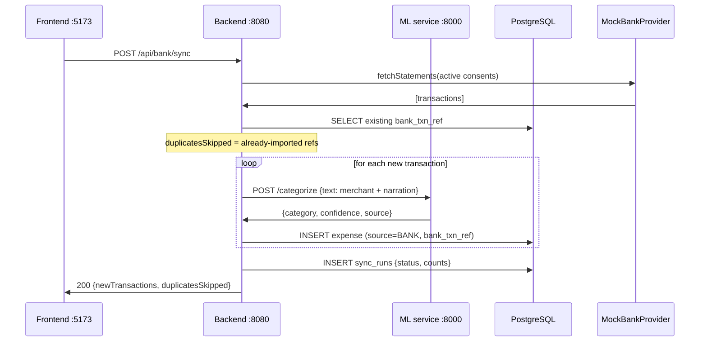

# Architecture

## Components

| Component | Technology | Port | Responsibility |
|-----------|-----------|------|----------------|
| Frontend | React + Vite | 5173 | All UI: dashboard, expenses, budgets, QR scan, bank pages. Calls the backend REST API (`/api`). Uses html5-qrcode / jsQR for client-side QR decoding. |
| Backend API | Java 17, Spring Boot (`com.expensetracker`) | 8080 | REST API under `/api`: auth (JWT), expense CRUD, budgets, recurring, QR parsing/OCR, bank consent + sync + import. Persists to PostgreSQL, calls the ML service over HTTP. |
| ML service | Python FastAPI (`app.main:app`) | 8000 | Stateless AI endpoints: `/categorize`, `/insights`, `/forecast`. The backend (and optionally the frontend for previews) calls it over HTTP. |
| Database | PostgreSQL 15+ | 5432 | System of record: users, expenses, budgets, recurring rules, bank consents/accounts/transactions, merchant learning map, sync run log. Database name: `expensetracker`. |
| BankProvider (interface) | Java interface in backend | — | Abstraction over a bank data source: `fetchStatements()`, `listAccounts()`. Swappable implementation point for a real provider. |
| MockBankProvider | Java implementation | — | Test double that reads transactions from a local `mock-statement.json` file. Used by the demo and tests. |
| QR module | Split: frontend + backend | — | Frontend: html5-qrcode (camera) and jsQR (image upload) decode QR codes in the browser. Backend: `POST /api/qr/parse` parses UPI payloads (`upi://pay?...`); `POST /api/qr/scan-image` decodes an uploaded image and falls back to Tesseract OCR to extract merchant/amount/date. |
| Scheduled sync job | Spring `@Scheduled` in backend | — | Runs daily: (1) pulls new transactions from the configured `BankProvider` for all active consents, dedups and categorizes them; (2) materializes due recurring expenses into the `expenses` table. |

## System Diagram

```mermaid
flowchart LR
    subgraph Client
        FE[React + Vite frontend<br/>:5173]
        CAM[Camera / QR image]
    end

    subgraph Services
        API[Spring Boot API<br/>com.expensetracker<br/>:8080]
        ML[FastAPI ML service<br/>:8000]
        QR[QR module<br/>UPI parser + Tesseract OCR]
    end

    subgraph Data
        PG[(PostgreSQL<br/>expensetracker<br/>:5432)]
    end

    subgraph BankIntegration
        BP{{BankProvider<br/>interface}}
        MOCK[MockBankProvider<br/>mock-statement.json]
        REAL[Real AA provider<br/>swappable in future]
    end

    FE -->|REST /api<br/>VITE_API_URL| API
    FE -->|direct ML preview<br/>VITE_ML_URL| ML
    CAM --> FE
    API -->|persist| PG
    API -->|POST /categorize<br/>/insights /forecast<br/>ml.service.url| ML
    API --> QR
    QR -->|decoded UPI payload| API
    API -->|fetchStatements| BP
    BP -.->|implements| MOCK
    BP -.->|future implementation| REAL
    MOCK -->|reads| MS[(mock-statement.json)]

    SCHED[@Scheduled sync job<br/>daily] --> API
```

**Bank provider swap note:** `BankProvider` is a plain Java interface (`fetchStatements(consentId)`, `listAccounts(consentId)`). The running system wires `MockBankProvider`, which reads canned transactions from `mock-statement.json`. A real Account Aggregator (AA) provider can be swapped in by implementing the same interface against the AA APIs — no changes to the sync job, dedup logic, or REST surface are needed.

## Request Flows

### (a) QR scan → prefill → save



If the QR cannot be decoded in the browser, the image is sent to `POST /api/qr/scan-image` (multipart). The backend first tries ZXing decoding, then falls back to Tesseract OCR and returns `{merchant, amount, date, rawText}` for manual review.

### (b) Bank sync → dedup → categorize



Dedup key: the provider's transaction reference stored in `expenses.bank_txn_ref`. The same `@Scheduled` job runs this flow daily for every active consent without user action.

### (c) Correction → merchant_map learning

```mermaid
sequenceDiagram
    participant U as User
    participant FE as Frontend :5173
    participant API as Backend :8080
    participant ML as ML service :8000
    participant PG as PostgreSQL

    U->>FE: Expense wrongly categorized — pick correct category
    FE->>API: POST /api/expenses/{id}/correct {category}
    API->>PG: UPDATE expenses SET category
    API->>PG: UPSERT merchant_map {merchant_key, category, hit_count+1}
    API->>FE: 200 {expense}
    Note over API,ML: Next categorization checks merchant_map first;<br/>rule hits return source="merchant_map"
    API->>ML: POST /categorize {text} (for a new expense)
    ML->>API: {category, confidence, source:"merchant_map"}
```

The `merchant_map` table is keyed by a normalized merchant string (`merchant_key`). A correction upserts the row and increments `hit_count`, so repeated corrections for the same merchant converge on the right category. The categorize path consults this table before falling back to the ML model.

## Security Notes

- Passwords are stored as hashes (`password_hash`); authentication uses signed JWTs passed as `Authorization: Bearer <token>`.
- The JWT secret comes from the `JWT_SECRET` environment variable — never hardcoded or committed.
- Bank integration stores only **masked** account numbers in `bank_accounts`; credentials, PINs, and OTPs are never stored.
- All endpoints under `/api` except `/api/auth/signup` and `/api/auth/login` require a valid JWT.
