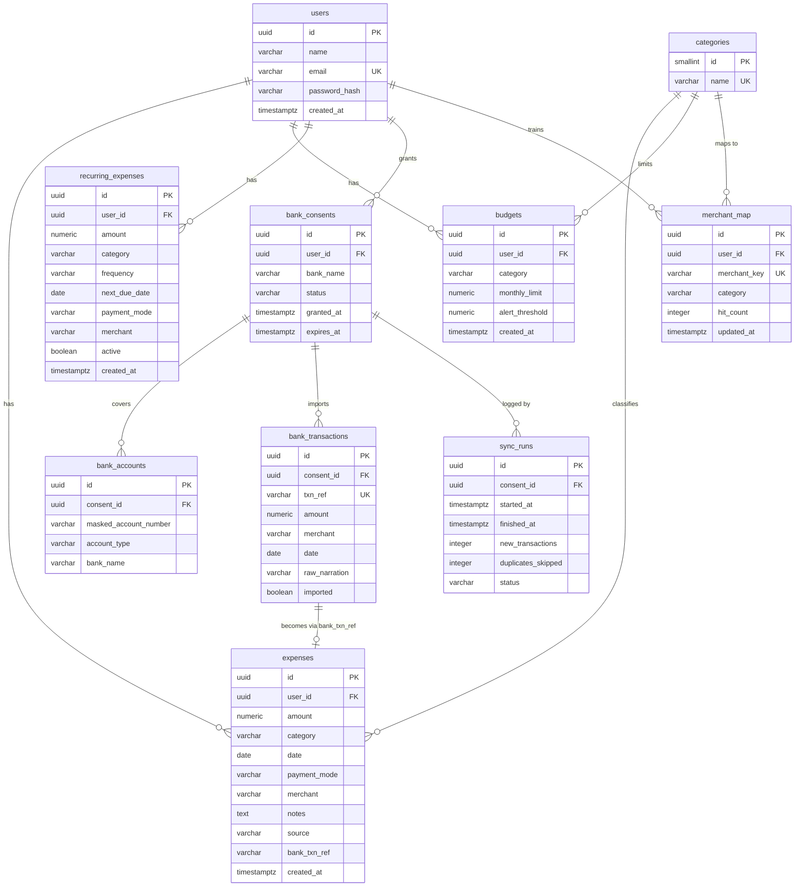

# Database

Database name: `expensetracker` (PostgreSQL 15+). The full DDL lives in `sql/schema.sql`.

## ER Diagram

## Tables

### users
One row per registered user. `id` is a UUID primary key; `email` is unique and used for login. `password_hash` stores a salted hash (BCrypt) — never a plaintext password.

| Column | Type | Notes |
|--------|------|-------|
| id | UUID PK | default `gen_random_uuid()` |
| name | VARCHAR(100) | display name |
| email | VARCHAR(255) UNIQUE NOT NULL | login identifier |
| password_hash | VARCHAR(255) NOT NULL | BCrypt hash |
| created_at | TIMESTAMPTZ | default `now()` |

### categories
Reference table for the 11 fixed categories. Seeded by `schema.sql`.

| Column | Type | Notes |
|--------|------|-------|
| id | SMALLSERIAL PK | |
| name | VARCHAR(50) UNIQUE NOT NULL | Food, Transport, Shopping, Utilities, Rent, Subscriptions, Health, Entertainment, Education, Travel, Other |

Expense and budget rows store the category **name** as text (matching the shared contract), while this table is the canonical list used for validation and dropdowns.

### expenses
The core fact table. One row per expense, owned by a user.

| Column | Type | Notes |
|--------|------|-------|
| id | UUID PK | |
| user_id | UUID NOT NULL FK → users | indexed with `date` |
| amount | NUMERIC(12,2) NOT NULL | always positive; CHECK (amount > 0) |
| category | VARCHAR(50) NOT NULL | one of the 11 categories |
| date | DATE NOT NULL | the day the money was spent |
| payment_mode | VARCHAR(30) | e.g. UPI, CARD, CASH, NETBANKING |
| merchant | VARCHAR(255) | payee / shop name |
| notes | TEXT | free text, also used by the ML categorizer |
| source | VARCHAR(20) NOT NULL | QR \| MANUAL \| BANK \| RECURRING |
| bank_txn_ref | VARCHAR(100) NULL | provider transaction id; dedup key for bank imports |
| created_at | TIMESTAMPTZ | default `now()` |

### budgets
Monthly spending limits per user per category. One budget per (user, category).

| Column | Type | Notes |
|--------|------|-------|
| id | UUID PK | |
| user_id | UUID NOT NULL FK → users | |
| category | VARCHAR(50) NOT NULL | |
| monthly_limit | NUMERIC(12,2) NOT NULL | CHECK (monthly_limit > 0) |
| alert_threshold | NUMERIC(3,2) NOT NULL | default 0.8; 0.8 = warn at 80% used |
| created_at | TIMESTAMPTZ | default `now()` |
| UNIQUE | (user_id, category) | one budget per category per user |

### recurring_expenses
Rules for expenses that repeat. The `@Scheduled` job materializes due rules into `expenses` with `source='RECURRING'` and advances `next_due_date`.

| Column | Type | Notes |
|--------|------|-------|
| id | UUID PK | |
| user_id | UUID NOT NULL FK → users | |
| amount | NUMERIC(12,2) NOT NULL | |
| category | VARCHAR(50) NOT NULL | |
| frequency | VARCHAR(20) NOT NULL | DAILY \| WEEKLY \| MONTHLY \| YEARLY |
| next_due_date | DATE NOT NULL | next date to materialize |
| payment_mode | VARCHAR(30) | copied onto generated expenses |
| merchant | VARCHAR(255) | copied onto generated expenses |
| active | BOOLEAN NOT NULL | default true; inactive rules are skipped |
| created_at | TIMESTAMPTZ | default `now()` |

### bank_consents
Records a user's consent for a bank data source. A consent links a user to a bank for statement syncing.

| Column | Type | Notes |
|--------|------|-------|
| id | UUID PK | returned as `consentId` by `POST /api/bank/consent` |
| user_id | UUID NOT NULL FK → users | |
| bank_name | VARCHAR(100) NOT NULL | e.g. "Mock Bank" |
| status | VARCHAR(20) NOT NULL | ACTIVE \| REVOKED \| EXPIRED |
| granted_at | TIMESTAMPTZ | default `now()` |
| expires_at | TIMESTAMPTZ NULL | |

### bank_accounts
Accounts discovered under a consent. **Only masked account numbers are stored** — never credentials, PINs, or full numbers.

| Column | Type | Notes |
|--------|------|-------|
| id | UUID PK | |
| consent_id | UUID NOT NULL FK → bank_consents | |
| masked_account_number | VARCHAR(50) NOT NULL | e.g. `XXXX-XXXX-1234` |
| account_type | VARCHAR(30) | SAVINGS \| CURRENT |
| bank_name | VARCHAR(100) | |

### bank_transactions
Raw transactions fetched from a `BankProvider` before they become expenses. `txn_ref` is unique per provider feed and drives dedup.

| Column | Type | Notes |
|--------|------|-------|
| id | UUID PK | |
| consent_id | UUID NOT NULL FK → bank_consents | |
| txn_ref | VARCHAR(100) UNIQUE NOT NULL | provider transaction reference |
| amount | NUMERIC(12,2) NOT NULL | |
| merchant | VARCHAR(255) | |
| date | DATE NOT NULL | |
| raw_narration | TEXT | original statement text |
| imported | BOOLEAN NOT NULL | default false; true once copied to `expenses` |

### merchant_map
Learning table for merchant → category corrections. Checked before the ML model during categorization.

| Column | Type | Notes |
|--------|------|-------|
| id | UUID PK | |
| user_id | UUID NOT NULL FK → users | learning is per user |
| merchant_key | VARCHAR(255) NOT NULL | normalized merchant string (lowercased, trimmed) |
| category | VARCHAR(50) NOT NULL | corrected category |
| hit_count | INTEGER NOT NULL | default 1; incremented on each correction |
| updated_at | TIMESTAMPTZ | default `now()` |
| UNIQUE | (user_id, merchant_key) | |

### sync_runs
Audit log of each bank sync (manual or scheduled).

| Column | Type | Notes |
|--------|------|-------|
| id | UUID PK | |
| consent_id | UUID NOT NULL FK → bank_consents | |
| started_at | TIMESTAMPTZ NOT NULL | default `now()` |
| finished_at | TIMESTAMPTZ NULL | |
| new_transactions | INTEGER NOT NULL | default 0 |
| duplicates_skipped | INTEGER NOT NULL | default 0 |
| status | VARCHAR(20) NOT NULL | RUNNING \| SUCCESS \| FAILED |

## Indexes and Constraints

- `CREATE INDEX idx_expenses_user_date ON expenses (user_id, date)` — the hot path for monthly summaries and budget alerts.
- `CREATE INDEX idx_expenses_bank_ref ON expenses (bank_txn_ref)` — dedup lookups during sync.
- `CREATE INDEX idx_merchant_map_lookup ON merchant_map (user_id, merchant_key)` — categorize-time rule lookup.
- Foreign keys with `ON DELETE CASCADE` from child tables to `users` and `bank_consents`, so removing a user or consent cleans up dependents.

The complete DDL, including all constraints, indexes, and the category seed data, is in [`sql/schema.sql`](sql/schema.sql).
